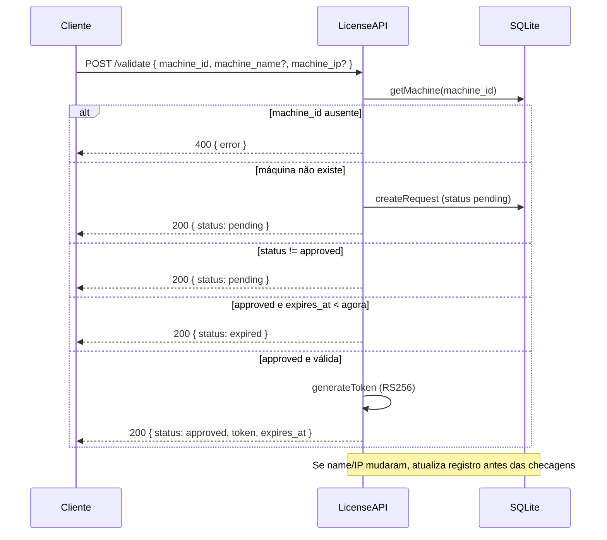
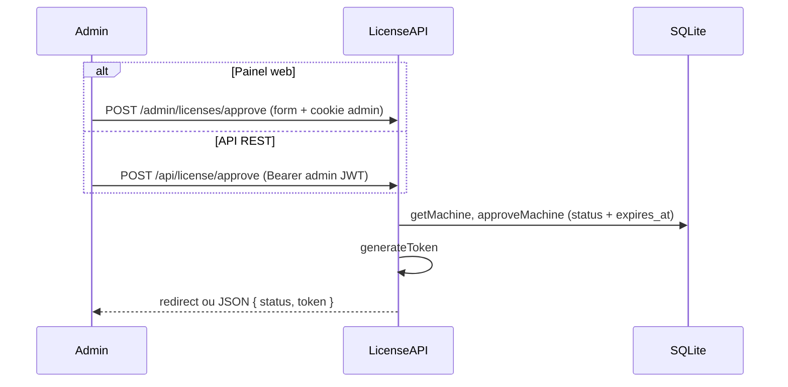
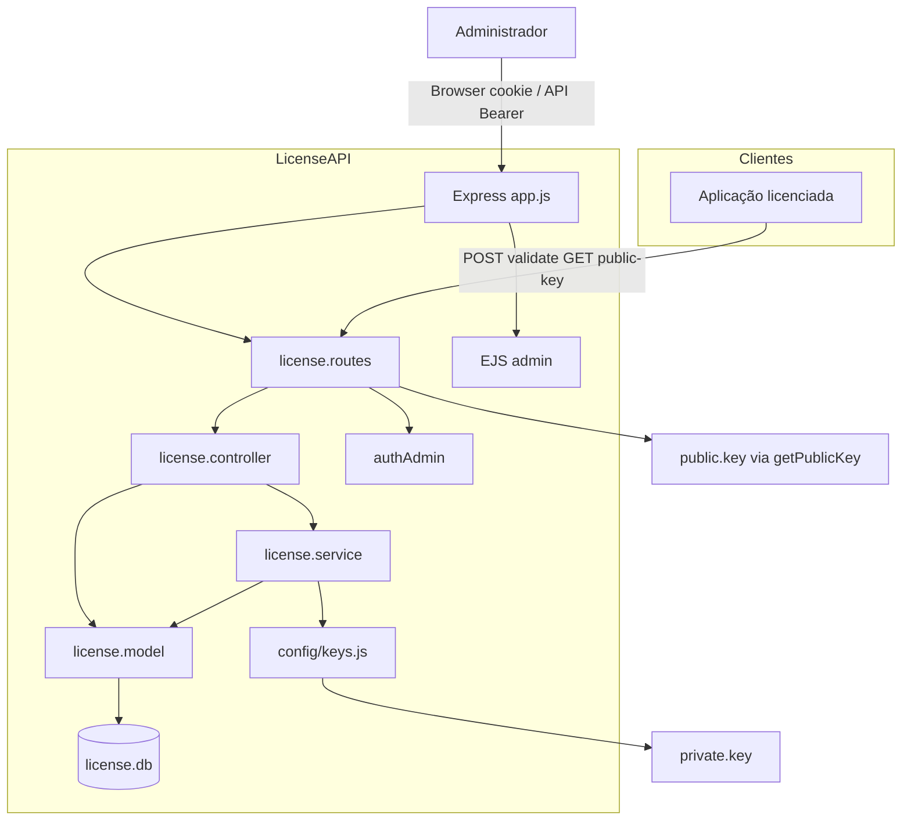

# LicenseAPI — Funcionamento do Sistema

Documentação interna que descreve a arquitetura, os fluxos e o comportamento do servidor de licenciamento por máquina.

Para integração em aplicações cliente, consulte também [integracao-cliente-licenca.md](./integracao-cliente-licenca.md).

---

## 1. Visão geral

O **LicenseAPI** é um serviço Node.js/Express que centraliza o controle de licenças de software por **máquina** (`machine_id`). Cada instalação cliente se identifica na primeira execução; o administrador aprova manualmente e define por quantos dias a licença vale. Máquinas aprovadas recebem um **JWT assinado com RS256** que o cliente pode validar localmente usando a chave pública exposta pela API.

| Papel | Responsabilidade |
|-------|------------------|
| **Cliente** | Envia `machine_id` (e opcionalmente nome/IP); trata `pending`, `expired` ou `approved`; opcionalmente valida o JWT offline. |
| **Servidor** | Persiste máquinas, aplica regras de status/expiração, emite tokens e oferece painel web para gestão. |
| **Administrador** | Aprova ou revoga licenças via painel (`/admin/licenses`) ou API protegida; pode editar registros no painel SQL. |

**Porta padrão:** `3001` (`PORT` no `.env`).

---

## 2. Stack e dependências

| Tecnologia | Uso |
|------------|-----|
| **Node.js + Express 5** | HTTP API e rotas administrativas |
| **better-sqlite3** | Banco SQLite síncrono (`license.db` na raiz do projeto) |
| **jsonwebtoken** | JWT de licença (RS256) e sessão admin (HS256 com `ADMIN_SECRET`) |
| **EJS** | Views do painel administrativo |
| **dotenv** | Variáveis de ambiente |
| **bcrypt** | Declarado no `package.json`; não usado no fluxo atual de licença/admin |

**Chaves criptográficas (raiz do projeto):**

- `private.key` — assinatura dos JWT de licença (carregada em `src/config/keys.js`)
- `public.key` — exposta em `GET /api/license/public-key` para validação no cliente

---

## 3. Estrutura do projeto

```
LicenseAPI/
├── private.key / public.key     # Par RSA para JWT de licença
├── license.db                   # SQLite (criado automaticamente)
├── .env                         # Configuração (não versionar segredos)
├── package.json
├── docs/
│   ├── funcionamento-sistema.md # Este documento
│   └── integracao-cliente-licenca.md
└── src/
    ├── app.js                   # Bootstrap Express, rotas admin inline, listen
    ├── config/
    │   └── keys.js              # Carrega PRIVATE_KEY
    ├── database/
    │   └── index.js             # Schema SQLite + migrações leves (ALTER)
    ├── models/
    │   └── license.model.js     # Acesso a dados (machines)
    ├── services/
    │   └── license.service.js   # Regras de negócio + geração JWT
    ├── controllers/
    │   └── license.controller.js
    ├── routes/
    │   ├── license.routes.js    # API /api/license/*
    │   └── admin.routes.js      # Router vazio (login movido para app.js)
    ├── middlewares/
    │   └── authAdmin.js         # JWT admin (header ou cookie)
    └── views/admin/
        ├── login.ejs
        ├── licenses.ejs         # Painel principal
        └── sql-panel.ejs        # CRUD manual no banco
```

**Camadas:**

1. **Rotas** → delegam ao controller ou renderizam views (admin em `app.js`).
2. **Controller** → validação HTTP mínima, chama service/model.
3. **Service** → fluxo de validação, aprovação e `generateToken`.
4. **Model** → SQL preparado sobre `better-sqlite3`.

---

## 4. Modelo de dados

Tabela `machines` (criada em `src/database/index.js`):

| Coluna | Tipo | Descrição |
|--------|------|-----------|
| `id` | INTEGER PK | Identificador interno |
| `machine_id` | TEXT UNIQUE | ID estável enviado pelo cliente |
| `machine_name` | TEXT | Nome amigável (opcional) |
| `machine_ip` | TEXT | IP reportado (opcional) |
| `system_name` | TEXT | Sistema/aplicação consumidor (opcional; ver [identificacao-sistema-cliente.md](./identificacao-sistema-cliente.md)) |
| `request_date` | TEXT | ISO 8601 UTC da **primeira** solicitação de licença |
| `status` | TEXT | `pending` (padrão) ou `approved` |
| `expires_at` | TEXT | ISO 8601 UTC; preenchido na aprovação |
| `created_at` | TEXT | Timestamp de criação (default SQLite) |

**Política de atualização (validate):**

| Campo | Primeira solicitação | Revalidações |
|-------|---------------------|--------------|
| `request_date` | Definido automaticamente | Imutável |
| `system_name` | Gravado se enviado | Atualizado apenas se enviado e diferente |
| `machine_name` / `machine_ip` | Gravados se enviados | Atualizados se enviados e diferentes |

**Estados lógicos (não são colunas separadas):**

| Situação | `status` | `expires_at` | Resposta do `validate` |
|----------|----------|--------------|------------------------|
| Nova / aguardando | `pending` | NULL | `{ "status": "pending" }` |
| Aprovada e válida | `approved` | futuro | `{ "status": "approved", "token", "expires_at" }` |
| Aprovada vencida | `approved` | passado | `{ "status": "expired" }` |
| Revogada | volta a `pending` | NULL | `{ "status": "pending" }` |

A revogação (`revokeMachine`) não apaga o registro: redefine `status` para `pending` e limpa `expires_at`.

---

## 5. Fluxos principais

### 5.1 Validação pelo cliente (`POST /api/license/validate`)



**Implementação:** `license.controller.validate` → `license.service.handleValidationRequest`.

Na primeira requisição, `createRequest` usa `INSERT OR IGNORE` e pode atualizar `machine_name` / `machine_ip` se já existir linha com o mesmo `machine_id`.

### 5.2 Aprovação de licença



`expires_at` = data atual + `days` (número inteiro do body/form).

### 5.3 Autenticação administrativa

```mermaid
flowchart LR
    subgraph login [Login]
        F[POST /admin/login] --> C{Credenciais .env?}
        C -->|sim| T[JWT HS256 role admin 1h]
        T --> CK[Cookie admin_token HttpOnly]
        CK --> P[/admin/licenses]
        C -->|não| E[Texto credenciais inválidas]
    end

    subgraph protegido [Rotas protegidas]
        R[Requisição] --> H{Authorization Bearer?}
        H -->|sim| V[verify ADMIN_SECRET]
        H -->|não| CK2[Cookie admin_token]
        CK2 --> V
        V --> OK[next]
    end
```

Middleware: `authAdmin.js` — aceita `Authorization: Bearer <token>` **ou** cookie `admin_token`.

---

## 6. API REST (`/api/license`)

| Método | Rota | Auth | Descrição |
|--------|------|------|-----------|
| `POST` | `/validate` | Nenhuma | Fluxo principal do cliente (seção 5.1) |
| `GET` | `/public-key` | Nenhuma | Conteúdo de `public.key` em JSON |
| `GET` | `/pending` | Admin JWT | Lista máquinas com `status = 'pending'` |
| `POST` | `/approve` | Admin JWT | Body: `{ machine_id, days }` → aprova e retorna token |

**Respostas típicas de `/validate`:** sempre JSON; erros de negócio em licença usam HTTP 200 com `status` no body (exceto 400 sem `machine_id`).

---

## 7. JWT de licença

| Aspecto | Valor |
|---------|--------|
| Algoritmo | **RS256** |
| Chave de assinatura | `private.key` (`PRIVATE_KEY` em `keys.js`) |
| Biblioteca | `jsonwebtoken` |

**Payload (claims customizadas + `exp`):**

| Claim | Origem |
|-------|--------|
| `machine_id` | Banco |
| `machine_name` | Banco (omitido se vazio) |
| `machine_ip` | Banco (omitido se vazio) |
| `company` | Fixo: `"Empresa Interna"` |
| `plan` | Fixo: `"internal"` |
| `exp` | Unix segundos derivado de `expires_at` |

O token é **reemitido** a cada `validate` bem-sucedido enquanto a licença estiver válida (não há cache de token no servidor).

---

## 8. Painel web administrativo

Rotas definidas em `src/app.js` (não em `admin.routes.js`, que está vazio).

| Rota | Método | Função |
|------|--------|--------|
| `/admin/login` | GET | Formulário de login |
| `/admin/login` | POST | Valida `ADMIN_USER` / `ADMIN_PASS`, define cookie, redirect |
| `/admin/licenses` | GET | Lista todas as máquinas + estatísticas (total, pending, approved ativos, expired) |
| `/admin/licenses/approve` | POST | `machine_id` + `days` → `service.approveMachine` |
| `/admin/licenses/revoke` | POST | `machine_id` → `model.revokeMachine` |
| `/admin/sql-panel` | GET | Tabela editável de todos os registros |
| `/admin/sql-panel/create` | POST | Cria licença manualmente |
| `/admin/sql-panel/update/:id` | POST | Atualiza um campo (`field`, `value`) |
| `/admin/sql-panel/delete/:id` | POST | Remove registro por `id` interno |

O painel SQL permite editar campos: `machine_id`, `machine_name`, `machine_ip`, `status`, `expires_at` (com validação e normalização para ISO UTC no model).

---

## 9. Variáveis de ambiente

| Variável | Obrigatória | Uso |
|----------|-------------|-----|
| `PORT` | Não | Porta HTTP (default `3001`) |
| `ADMIN_USER` | Sim* | Login do painel |
| `ADMIN_PASS` | Sim* | Senha do painel |
| `ADMIN_SECRET` | Sim* | Segredo HS256 para JWT de admin |

\*Necessárias para login admin e rotas protegidas funcionarem corretamente.

**Arquivos externos obrigatórios para licença assinada:**

- `private.key` na raiz — sem ele, `PRIVATE_KEY` fica `null` e a assinatura falhará em runtime.

---

## 10. Inicialização e execução

```bash
npm install
# Configurar .env e chaves private.key / public.key
npm start      # node src/app.js
# ou
npm run dev    # nodemon src/app.js
```

Na subida:

1. `dotenv` carrega `.env`.
2. `database/index.js` cria tabela `machines` se não existir e tenta `ALTER` para colunas legadas.
3. Express monta `/api/license` e rotas `/admin/*`.
4. Servidor escuta em `PORT`.

O arquivo `license.db` é criado/atualizado no diretório de trabalho atual (geralmente a raiz do projeto).

---

## 11. Diagrama de arquitetura



---

## 12. Segurança e limitações conhecidas

| Tópico | Comportamento atual |
|--------|---------------------|
| `/validate` e `/public-key` | Públicos; qualquer um pode registrar `machine_id` e obter status |
| Admin | JWT 1h em cookie HttpOnly ou header; credenciais em texto no `.env` |
| Revogação | Volta para `pending`; cliente que já guardou JWT deve falhar na checagem de `exp` ou revalidar |
| Rate limiting | Não implementado |
| HTTPS | Responsabilidade do deploy (reverse proxy) |
| `bcrypt` | Não utilizado no login (comparação direta com `ADMIN_PASS`) |

---

## 13. Mapa código ↔ responsabilidade

| Arquivo | Responsabilidade |
|---------|------------------|
| `src/app.js` | Servidor, login admin, rotas do painel licenses/sql-panel |
| `src/routes/license.routes.js` | Endpoints da API de licença |
| `src/controllers/license.controller.js` | HTTP: validate, pending, approve, public-key |
| `src/services/license.service.js` | Regras de validação, aprovação, `generateToken` |
| `src/models/license.model.js` | CRUD SQLite, validação de campos no sql-panel |
| `src/database/index.js` | Conexão e schema |
| `src/middlewares/authAdmin.js` | Proteção rotas admin (API e implícito nas rotas em app.js) |
| `src/config/keys.js` | Leitura de `private.key` |

---

## 14. Referências cruzadas

- **Integração cliente (payloads, exemplos HTTP, checklist):** [integracao-cliente-licenca.md](./integracao-cliente-licenca.md)
- **Identificação do sistema consumidor (`system_name`):** [identificacao-sistema-cliente.md](./identificacao-sistema-cliente.md)
- **Código-fonte canônico dos fluxos:** `src/services/license.service.js` (`handleValidationRequest`, `approveMachine`)

---

*Documento gerado com base na análise do repositório LicenseAPI (Node.js/Express, SQLite, JWT RS256).*
